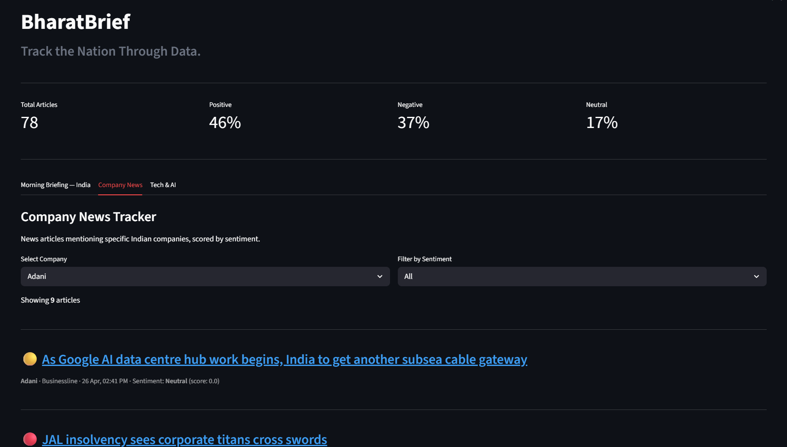

# BharatBrief — Track the Nation Through Data



> Fetches live headlines from major Indian news sources, scores each one as Positive / Negative / Neutral using NLP, and displays them in a clean 3-tab Streamlit dashboard.

** Live Demo → [bharatbrief.streamlit.app](https://bharatbrief.streamlit.app)**

---

##  What It Looks Like

| Tab | What you see |
|---|---|
|  Morning Briefing | Top headlines from Indian newspapers with sentiment labels |
|  Company News | Articles mentioning Reliance, TCS, Infosys, Adani, HDFC, Wipro, Zomato |
|  Tech & AI | Latest from TechCrunch, The Verge, Wired, Ars Technica |

---

##  What This Project Covers

This is a beginner-to-intermediate data pipeline project. It demonstrates:

-  **API Integration** — connecting to a real REST API (NewsAPI) using Python
-  **Data Cleaning** — handling nulls, duplicates, HTML entities, date parsing with Pandas + Regex
-  **NLP Sentiment Analysis** — scoring headlines using VADER (offline, no GPU needed)
-  **Data Pipeline thinking** — fetch → clean → score → save → visualise
-  **Streamlit Deployment** — turning a Python script into a shareable live web app

---

##  Project Structure

```
bharatbrief-news-sentiment/
│
├── app.py
├── india_pulse_simple.ipynb
├── requirements.txt
├── README.md
│
├── assets/
│   └── dashboard.png
```

---

##  How It Works

```
NewsAPI (live headlines)
       ↓
  Python Notebook
  ├── Fetch: India sources, Tech sources, Company keywords
  ├── Clean: remove junk, deduplicate, parse dates
  └── Score: VADER sentiment → Positive / Negative / Neutral
       ↓
  news_data.csv
       ↓
  Streamlit Dashboard (3 tabs)
```

---

##  Run It Locally

### 1. Clone the repo
```bash
git clone https://github.com/dashminded/bharatbrief.git
cd bharatbrief
```

### 2. Install dependencies
```bash
pip install -r requirements.txt
```

### 3. Get a free NewsAPI key
- Go to [newsapi.org](https://newsapi.org) → Register → Copy your API key
- Free tier: 100 requests/day — more than enough for this project

### 4. Add your API key
Open `bharatbrief.ipynb` and find this line in the config cell:
```python
API_KEY = "your_newsapi_key_here"   # ← paste here
```

### 5. Run the notebook
```
Kernel → Restart & Run All
```
This fetches live news and creates `news_data.csv`

### 6. Launch the dashboard
```bash
streamlit run app.py
```
Opens at `http://localhost:8501`

---

##  Dependencies

```
newsapi-python
vaderSentiment
streamlit
pandas
```

Install all at once:
```bash
pip install newsapi-python vaderSentiment streamlit pandas
```

---

##  Notebook Walkthrough

| Step | What happens |
|---|---|
| **Step 1** | Install libraries + imports |
| **Step 2** | Connect to NewsAPI → fetch India, Tech, Company headlines |
| **Step 3** | Clean raw data — skip deleted articles, remove duplicates, parse dates, strip HTML |
| **Step 4** | Score each headline with VADER → adds `sentiment` and `score` columns |
| **Step 5** | Preview results in the notebook → save to `news_data.csv` |

---

##  Key Learning Points

**Why VADER for sentiment?**
VADER (Valence Aware Dictionary and sEntiment Reasoner) is specifically tuned for short texts like news headlines. It works offline, requires zero API calls, and returns a compound score from -1.0 (most negative) to +1.0 (most positive).

**Why `sources=` instead of `country='in'`?**
NewsAPI's free tier has unreliable coverage for `country='in'`. Using specific Indian newspaper source IDs (`the-times-of-india`, `ndtv`, `the-hindu` etc.) gives consistent results.

**Why CSV instead of a database?**
For a learning project of this scale, a CSV is simpler, portable, and easy to inspect. Anyone can open `news_data.csv` in Excel and immediately understand the data — no database setup required.

---

##  Known Limitations

- **Free NewsAPI tier** — 100 requests/day limit. Company-specific deep search (`/everything` endpoint) requires a paid plan.
- **No auto-refresh** — You need to re-run the notebook manually to get fresh headlines. Automation via GitHub Actions is a possible next step.
- **English only** — NewsAPI free tier filters by `language='en'`. Hindi sources are not included.

---

##  Possible Next Steps

- [ ] Schedule the notebook to run daily using GitHub Actions
- [ ] Add a SQLite database to store historical data and show 7-day trends
- [ ] Add stock price overlay (yfinance) for company news tab
- [ ] Upgrade to NewsAPI paid tier for `/everything` keyword search

---

##  Author

Built by ** Ashutosh ** as part of a Data Analytics portfolio.

-  GitHub: [github.com/dashminded](https://github.com/dashminded)
-  LinkedIn: [linkedin.com/in/ashutosh772](https://linkedin.com/in/ashutosh772)

---

##  License

MIT License — free to use, modify, and share with attribution.
